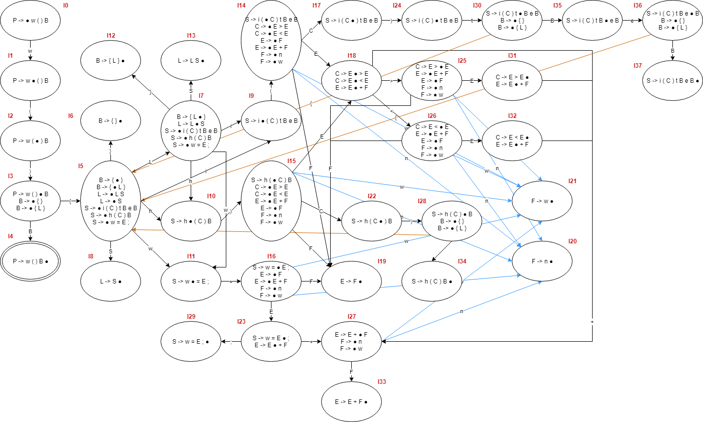

# PLCOMP_Assignment
Team Assignment for 'Programming Language and Compiler' class

## Assignment File
[File](Compiler_Project-2019.pdf)

## Things to do
 - Scanner
 - Parser
 - Code Generator

## Grammar
### Given Grammar
```
prog    ::= word "(" ")" block ;
block	::= "{" slist "}"	
        |   ;
slist 	::= slist stat
        |   stat ;
stat 	::= IF "(" cond ")" THEN block ELSE block
        |   WHILE "(" cond ")" block
        |   word "=" expr ";"
        |   ;
cond 	::= expr ">" expr
        |   expr "<" expr ;
expr 	::= fact
        |   expr "+" fact ;	
fact 	::= num
        |   word ;
word	::= ([a-z] | [A-Z])* ;
num     ::= [0-9]*
```
### Modified Grammar
```
prog    ::= word "(" ")" block ;
block   ::= "{" slist "}";
slist   ::= slist stat
        |   stat ;
stat 	::= IF "(" cond ")" THEN block ELSE block
        |   WHILE "(" cond ")" block
        |   word "=" expr ";"
        |   ;
cond 	::= expr ">" expr
        |   expr "<" expr ;
expr 	::= fact
        |   expr "+" fact ;	
fact 	::= num
        |   word ;
word	::= ([a-z] | [A-Z])+ ;
num     ::= [0-9]+
```
1. remove ε at block: ε can cause function without its body.
2. change * to + at word and num: * can cause empty word and num, so that statements like =3+++4 is a correct grammar.

## Scanner
 - Divide letters according to its usage
   - word: \[a-zA-Z]+
   - num: \[0-9]+
   - keyword: IF, THEN, ELSE, WHILE
   - separator: (, ), {, }, ;
   - operator: +, >, <, =
 - Tokenizing according to its type
   - Python - [scan.py](scanner/scan.py)
   - C - [scan.c](scanner/scan.c)

## Parser
### Grammar for Parser
 - Tokens from scanner are terminals.
 - Other things are non-terminals.
 - Production rule is given in original grammar.
 - Start Symbol is prog.
```
prog    ::= word "(" ")" block ;
block   ::= "{" slist "}";
slist   ::= slist stat
        |   stat ;
stat 	::= IF "(" cond ")" THEN block ELSE block
        |   WHILE "(" cond ")" block
        |   word "=" expr ";"
        |   ;
cond 	::= expr ">" expr
        |   expr "<" expr ;
expr 	::= fact
        |   expr "+" fact ;	
fact 	::= num
        |   word ;
```
Remove ε
```
prog    ::= word "(" ")" block ;
block   ::= "{" slist "}"
        |   "{" "}";
slist   ::= slist stat
        |   stat ;
stat 	::= IF "(" cond ")" THEN block ELSE block
        |   WHILE "(" cond ")" block
        |   word "=" expr ";" ;
cond 	::= expr ">" expr
        |   expr "<" expr ;
expr 	::= fact
        |   expr "+" fact ;	
fact 	::= num
        |   word ;
```
### SLR Parser
1. DFA (start symbol P)

For convenience, all syntax were symbolized as below.

|original syntax|symbol|
|:-------------:|:----:|
|prog|P|
|block|B|
|slist|L|
|stat|S|
|cond|C|
|expr|E|
|fact|F|
|IF|i|
|THEN|t|
|ELSE|e|
|WHILE|h|
|word|w|
|num|n|
With this symbol, grammar can be re-written as below.
```
P       ->  w "(" ")" B ;
B       ->  "{" L "}"
B       ->  "{" "}";
L       ->  L S
L       ->  S ;
S   	->  i "(" C ")" t B e B
S       ->  h "(" C ")" B
S       ->  w "=" E ";" ;
C   	->  E ">" E
C       ->  E "<" E ;
E   	->  F
E       ->  E "+" F ;
F   	->  n
F       ->  w ;
```
2. Follow of nonterminals
```
follow(P) = { $ }
follow(B) = { e } ∪ follow(P) ∪ follow(S) = { e, $, '}', i, h, w }
follow(L) = { '}' } ∪ first(S) = { '}', i, h, w}
follow(S) = follow(L) = { '}', i, h, w}
follow(C) = { ')' }
follow(E) = { '>', '<' } ∪ follow(C) = { '>', '<', ')' }
follow(F) = follow(E) = { '>', '<', ')' }
```
3. Parsing table
<table>
    <tr>
        <td rowspan=2 align=center>State</td>
        <td colspan=15 align=center>Action</td>
        <td colspan=7 align=center>Goto</td>
    </tr>
    <tr>
        <td>n</td>
        <td>w</td>
        <td>i</td>
        <td>t</td>
        <td>e</td>
        <td>h</td>
        <td><</td>
        <td>></td>
        <td>=</td>
        <td>+</td>
        <td>(</td>
        <td>)</td>
        <td>{</td>
        <td>}</td>
        <td>$</td>
        <td>B</td>
        <td>L</td>
        <td>S</td>
        <td>C</td>
        <td>E</td>
        <td>F</td>
    </tr>
    <tr>
        <td>0</td>
        <td/>
        <td>S1</td>
        <td/>
        <td/>
        <td/>
        <td/>
        <td/>
        <td/>
        <td/>
        <td/>
        <td/>
        <td/>
        <td/>
        <td/>
        <td/>
        <td/>
        <td/>
        <td/>
        <td/>
        <td/>
        <td/>
    </tr>
    <tr>
        <td>1</td>
        <td/>
        <td/>
        <td/>
        <td/>
        <td/>
        <td/>
        <td/>
        <td/>
        <td/>
        <td/>
        <td>S2</td>
        <td/>
        <td/>
        <td/>
        <td/>
        <td/>
        <td/>
        <td/>
        <td/>
        <td/>
        <td/>
    </tr>
    <tr>
        <td>2</td>
        <td/>
        <td/>
        <td/>
        <td/>
        <td/>
        <td/>
        <td/>
        <td/>
        <td/>
        <td/>
        <td/>
        <td>S3</td>
        <td/>
        <td/>
        <td/>
        <td/>
        <td/>
        <td/>
        <td/>
        <td/>
        <td/>
    </tr>
    <tr>
        <td>3</td>
        <td/>
        <td/>
        <td/>
        <td/>
        <td/>
        <td/>
        <td/>
        <td/>
        <td/>
        <td/>
        <td/>
        <td/>
        <td>S5</td>
        <td/>
        <td/>
        <td>4</td>
        <td/>
        <td/>
        <td/>
        <td/>
        <td/>
    </tr>
    <tr>
        <td>4</td>
        <td/>
        <td/>
        <td/>
        <td/>
        <td/>
        <td/>
        <td/>
        <td/>
        <td/>
        <td/>
        <td/>
        <td/>
        <td/>
        <td/>
        <td>A</td>
        <td/>
        <td/>
        <td/>
        <td/>
        <td/>
        <td/>
    </tr>
    <tr>
        <td>5</td>
        <td/>
        <td/>
        <td/>
        <td/>
        <td/>
        <td/>
        <td/>
        <td/>
        <td/>
        <td/>
        <td/>
        <td/>
        <td/>
        <td/>
        <td/>
        <td/>
        <td/>
        <td/>
        <td/>
        <td/>
        <td/>
    </tr>
    <tr>
        <td>6</td>
        <td/>
        <td/>
        <td/>
        <td/>
        <td/>
        <td/>
        <td/>
        <td/>
        <td/>
        <td/>
        <td/>
        <td/>
        <td/>
        <td/>
        <td/>
        <td/>
        <td/>
        <td/>
        <td/>
        <td/>
        <td/>
    </tr>
    <tr>
        <td>7</td>
        <td/>
        <td/>
        <td/>
        <td/>
        <td/>
        <td/>
        <td/>
        <td/>
        <td/>
        <td/>
        <td/>
        <td/>
        <td/>
        <td/>
        <td/>
        <td/>
        <td/>
        <td/>
        <td/>
        <td/>
        <td/>
    </tr>
    <tr>
        <td>8</td>
        <td/>
        <td/>
        <td/>
        <td/>
        <td/>
        <td/>
        <td/>
        <td/>
        <td/>
        <td/>
        <td/>
        <td/>
        <td/>
        <td/>
        <td/>
        <td/>
        <td/>
        <td/>
        <td/>
        <td/>
        <td/>
    </tr>
    <tr>
        <td>9</td>
        <td/>
        <td/>
        <td/>
        <td/>
        <td/>
        <td/>
        <td/>
        <td/>
        <td/>
        <td/>
        <td/>
        <td/>
        <td/>
        <td/>
        <td/>
        <td/>
        <td/>
        <td/>
        <td/>
        <td/>
        <td/>
    </tr>
    <tr>
        <td>10</td>
        <td/>
        <td/>
        <td/>
        <td/>
        <td/>
        <td/>
        <td/>
        <td/>
        <td/>
        <td/>
        <td/>
        <td/>
        <td/>
        <td/>
        <td/>
        <td/>
        <td/>
        <td/>
        <td/>
        <td/>
        <td/>
    </tr>
    <tr>
        <td>11</td>
        <td/>
        <td/>
        <td/>
        <td/>
        <td/>
        <td/>
        <td/>
        <td/>
        <td/>
        <td/>
        <td/>
        <td/>
        <td/>
        <td/>
        <td/>
        <td/>
        <td/>
        <td/>
        <td/>
        <td/>
        <td/>
    </tr>
    <tr>
        <td>12</td>
        <td/>
        <td/>
        <td/>
        <td/>
        <td/>
        <td/>
        <td/>
        <td/>
        <td/>
        <td/>
        <td/>
        <td/>
        <td/>
        <td/>
        <td/>
        <td/>
        <td/>
        <td/>
        <td/>
        <td/>
        <td/>
    </tr>
    <tr>
        <td>13</td>
        <td/>
        <td/>
        <td/>
        <td/>
        <td/>
        <td/>
        <td/>
        <td/>
        <td/>
        <td/>
        <td/>
        <td/>
        <td/>
        <td/>
        <td/>
        <td/>
        <td/>
        <td/>
        <td/>
        <td/>
        <td/>
    </tr>
    <tr>
        <td>14</td>
        <td/>
        <td/>
        <td/>
        <td/>
        <td/>
        <td/>
        <td/>
        <td/>
        <td/>
        <td/>
        <td/>
        <td/>
        <td/>
        <td/>
        <td/>
        <td/>
        <td/>
        <td/>
        <td/>
        <td/>
        <td/>
    </tr>
    <tr>
        <td>15</td>
        <td/>
        <td/>
        <td/>
        <td/>
        <td/>
        <td/>
        <td/>
        <td/>
        <td/>
        <td/>
        <td/>
        <td/>
        <td/>
        <td/>
        <td/>
        <td/>
        <td/>
        <td/>
        <td/>
        <td/>
        <td/>
    </tr>
    <tr>
        <td>16</td>
        <td/>
        <td/>
        <td/>
        <td/>
        <td/>
        <td/>
        <td/>
        <td/>
        <td/>
        <td/>
        <td/>
        <td/>
        <td/>
        <td/>
        <td/>
        <td/>
        <td/>
        <td/>
        <td/>
        <td/>
        <td/>
    </tr>
    <tr>
        <td>17</td>
        <td/>
        <td/>
        <td/>
        <td/>
        <td/>
        <td/>
        <td/>
        <td/>
        <td/>
        <td/>
        <td/>
        <td/>
        <td/>
        <td/>
        <td/>
        <td/>
        <td/>
        <td/>
        <td/>
        <td/>
        <td/>
    </tr>
    <tr>
        <td>18</td>
        <td/>
        <td/>
        <td/>
        <td/>
        <td/>
        <td/>
        <td/>
        <td/>
        <td/>
        <td/>
        <td/>
        <td/>
        <td/>
        <td/>
        <td/>
        <td/>
        <td/>
        <td/>
        <td/>
        <td/>
        <td/>
    </tr>
    <tr>
        <td>19</td>
        <td/>
        <td/>
        <td/>
        <td/>
        <td/>
        <td/>
        <td/>
        <td/>
        <td/>
        <td/>
        <td/>
        <td/>
        <td/>
        <td/>
        <td/>
        <td/>
        <td/>
        <td/>
        <td/>
        <td/>
        <td/>
    </tr>
    <tr>
        <td>20</td>
        <td/>
        <td/>
        <td/>
        <td/>
        <td/>
        <td/>
        <td/>
        <td/>
        <td/>
        <td/>
        <td/>
        <td/>
        <td/>
        <td/>
        <td/>
        <td/>
        <td/>
        <td/>
        <td/>
        <td/>
        <td/>
    </tr>
    <tr>
        <td>21</td>
        <td/>
        <td/>
        <td/>
        <td/>
        <td/>
        <td/>
        <td/>
        <td/>
        <td/>
        <td/>
        <td/>
        <td/>
        <td/>
        <td/>
        <td/>
        <td/>
        <td/>
        <td/>
        <td/>
        <td/>
        <td/>
    </tr>
    <tr>
        <td>22</td>
        <td/>
        <td/>
        <td/>
        <td/>
        <td/>
        <td/>
        <td/>
        <td/>
        <td/>
        <td/>
        <td/>
        <td/>
        <td/>
        <td/>
        <td/>
        <td/>
        <td/>
        <td/>
        <td/>
        <td/>
        <td/>
    </tr>
    <tr>
        <td>23</td>
        <td/>
        <td/>
        <td/>
        <td/>
        <td/>
        <td/>
        <td/>
        <td/>
        <td/>
        <td/>
        <td/>
        <td/>
        <td/>
        <td/>
        <td/>
        <td/>
        <td/>
        <td/>
        <td/>
        <td/>
        <td/>
    </tr>
    <tr>
        <td>24</td>
        <td/>
        <td/>
        <td/>
        <td/>
        <td/>
        <td/>
        <td/>
        <td/>
        <td/>
        <td/>
        <td/>
        <td/>
        <td/>
        <td/>
        <td/>
        <td/>
        <td/>
        <td/>
        <td/>
        <td/>
        <td/>
    </tr>
    <tr>
        <td>25</td>
        <td/>
        <td/>
        <td/>
        <td/>
        <td/>
        <td/>
        <td/>
        <td/>
        <td/>
        <td/>
        <td/>
        <td/>
        <td/>
        <td/>
        <td/>
        <td/>
        <td/>
        <td/>
        <td/>
        <td/>
        <td/>
    </tr>
    <tr>
        <td>26</td>
        <td/>
        <td/>
        <td/>
        <td/>
        <td/>
        <td/>
        <td/>
        <td/>
        <td/>
        <td/>
        <td/>
        <td/>
        <td/>
        <td/>
        <td/>
        <td/>
        <td/>
        <td/>
        <td/>
        <td/>
        <td/>
    </tr>
    <tr>
        <td>27</td>
        <td/>
        <td/>
        <td/>
        <td/>
        <td/>
        <td/>
        <td/>
        <td/>
        <td/>
        <td/>
        <td/>
        <td/>
        <td/>
        <td/>
        <td/>
        <td/>
        <td/>
        <td/>
        <td/>
        <td/>
        <td/>
    </tr>
    <tr>
        <td>28</td>
        <td/>
        <td/>
        <td/>
        <td/>
        <td/>
        <td/>
        <td/>
        <td/>
        <td/>
        <td/>
        <td/>
        <td/>
        <td/>
        <td/>
        <td/>
        <td/>
        <td/>
        <td/>
        <td/>
        <td/>
        <td/>
    </tr>
    <tr>
        <td>29</td>
        <td/>
        <td/>
        <td/>
        <td/>
        <td/>
        <td/>
        <td/>
        <td/>
        <td/>
        <td/>
        <td/>
        <td/>
        <td/>
        <td/>
        <td/>
        <td/>
        <td/>
        <td/>
        <td/>
        <td/>
        <td/>
    </tr>
    <tr>
        <td>30</td>
        <td/>
        <td/>
        <td/>
        <td/>
        <td/>
        <td/>
        <td/>
        <td/>
        <td/>
        <td/>
        <td/>
        <td/>
        <td/>
        <td/>
        <td/>
        <td/>
        <td/>
        <td/>
        <td/>
        <td/>
        <td/>
    </tr>
    <tr>
        <td>31</td>
        <td/>
        <td/>
        <td/>
        <td/>
        <td/>
        <td/>
        <td/>
        <td/>
        <td/>
        <td/>
        <td/>
        <td/>
        <td/>
        <td/>
        <td/>
        <td/>
        <td/>
        <td/>
        <td/>
        <td/>
        <td/>
    </tr>
    <tr>
        <td>32</td>
        <td/>
        <td/>
        <td/>
        <td/>
        <td/>
        <td/>
        <td/>
        <td/>
        <td/>
        <td/>
        <td/>
        <td/>
        <td/>
        <td/>
        <td/>
        <td/>
        <td/>
        <td/>
        <td/>
        <td/>
        <td/>
    </tr>
    <tr>
        <td>33</td>
        <td/>
        <td/>
        <td/>
        <td/>
        <td/>
        <td/>
        <td/>
        <td/>
        <td/>
        <td/>
        <td/>
        <td/>
        <td/>
        <td/>
        <td/>
        <td/>
        <td/>
        <td/>
        <td/>
        <td/>
        <td/>
    </tr>
    <tr>
        <td>34</td>
        <td/>
        <td/>
        <td/>
        <td/>
        <td/>
        <td/>
        <td/>
        <td/>
        <td/>
        <td/>
        <td/>
        <td/>
        <td/>
        <td/>
        <td/>
        <td/>
        <td/>
        <td/>
        <td/>
        <td/>
        <td/>
    </tr>
    <tr>
        <td>35</td>
        <td/>
        <td/>
        <td/>
        <td/>
        <td/>
        <td/>
        <td/>
        <td/>
        <td/>
        <td/>
        <td/>
        <td/>
        <td/>
        <td/>
        <td/>
        <td/>
        <td/>
        <td/>
        <td/>
        <td/>
        <td/>
    </tr>
    <tr>
        <td>36</td>
        <td/>
        <td/>
        <td/>
        <td/>
        <td/>
        <td/>
        <td/>
        <td/>
        <td/>
        <td/>
        <td/>
        <td/>
        <td/>
        <td/>
        <td/>
        <td/>
        <td/>
        <td/>
        <td/>
        <td/>
        <td/>
    </tr>
    <tr>
        <td>37</td>
        <td/>
        <td/>
        <td/>
        <td/>
        <td/>
        <td/>
        <td/>
        <td/>
        <td/>
        <td/>
        <td/>
        <td/>
        <td/>
        <td/>
        <td/>
        <td/>
        <td/>
        <td/>
        <td/>
        <td/>
        <td/>
    </tr>
</table>

## Code Generator
TODO.
