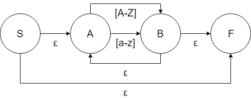
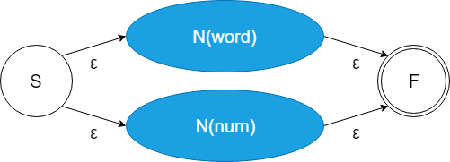
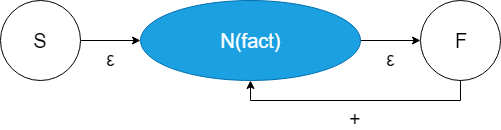
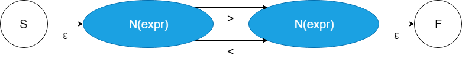
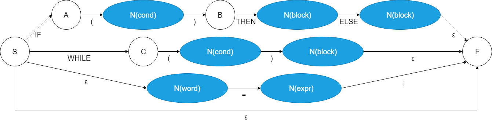
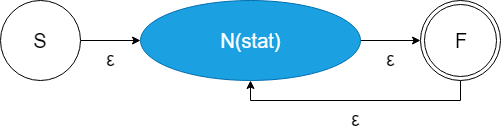
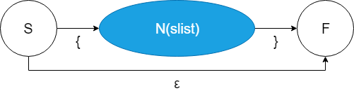
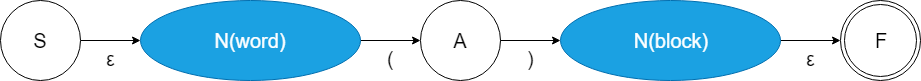

# PLCOMP_Assignment
Team Assignment for 'Programming Language and Compiler' class

## Assignment File
[File](Compiler_Project-2019.pdf)

## Things to do
 - Scanner
 - Parser
 - Code Generator

## Grammar
### Given Grammar
```
prog    ::= word "(" ")" block ;
block	::= "{" slist "}"	
        |   ;
slist 	::= slist stat
        |   stat ;
stat 	::= IF "(" cond ")" THEN block ELSE block
        |   WHILE "(" cond ")" block
        |   word "=" expr ";"
        |   ;
cond 	::= expr ">" expr
        |   expr "<" expr ;
expr 	::= fact
        |   expr "+" fact ;	
fact 	::= num
        |   word ;
word	::= ([a-z] | [A-Z])* ;
num     ::= [0-9]*
```
### Modified Grammar
```
prog    ::= word "(" ")" block ;
block   ::= "{" slist "}";
slist   ::= slist stat
        |   stat ;
stat 	::= IF "(" cond ")" THEN block ELSE block
        |   WHILE "(" cond ")" block
        |   word "=" expr ";"
        |   ;
cond 	::= expr ">" expr
        |   expr "<" expr ;
expr 	::= fact
        |   expr "+" fact ;	
fact 	::= num
        |   word ;
word	::= ([a-z] | [A-Z])+ ;
num     ::= [0-9]+
```
1. remove ε at block: ε can cause function without its body.
2. change * to + at word and num: * can cause empty word and num, so that statements like =3+++4 is a correct grammar.

## Scanner
 - Divide letters according to its usage
   - word: \[a-zA-Z]+
   - num: \[0-9]+
   - keyword: IF, THEN, ELSE, WHILE
   - separator: (, ), {, }, ;
   - operator: +, >, <, =
 - Tokenizing according to its type
   - Python - [scan.py](scanner/scan.py)
   - C - [scan.c](scanner/scan.c)
<!--### Convert to Regular Grammar
 - num

Remove Kleene star
```
num     ->  [0-9] num
num     ->  [0-9]
```
 - word

Remove Kleene star
```
word    ->  [a-zA-Z] word
word    ->  [a-zA-Z]
```
Union
```
word    ->  [a-zA-Z] word
word    ->  [a-zA-Z]
```
(consider \[a-zA-z] as __one__ kind of terminal)
 - fact

Union
```
fact    ->  word
fact    ->  num
```
 - expr

Remove recursion
```
expr    ->  fact ("+" fact)*
```
Remove Kleene star
```
expr    ->  fact exprA
exprA   ->  ε
exprA   ->  "+" fact exprA
```
Empty production
```
expr    ->  fact
expr    ->  fact exprA
exprA   ->  "+" fact
exprA   ->  "+" fact exprA
```
Remove multiple non-terminals
```
expr    ->  fact
expr    ->  exprB
exprA   ->  "+" fact
exprA   ->  "+" exprB
exprB   ->  word exprA
exprB   ->  num exprA
```
```
expr    ->  fact
expr    ->  exprB
exprA   ->  "+" fact
exprA   ->  "+" exprB
exprB   ->  [a-zA-Z] exprA
exprB   ->  [a-zA-Z] exprB
exprC   ->  [0-9] exprA
exprC   ->  [0-9] exprC
```
<!-- - cond
```
```
<!-- ### Each Grammar to NFA
 - num
 
 
 - word
 
 
 - fact
 
 
 - expr
 
 
 - cond
 
 
 - stat
 
 
 - slist
 
 
 - block
 
 
 - prog
 
 

### Combining NFAs
TODO.-->

## Parser
TODO.

## Code Generator
TODO.
